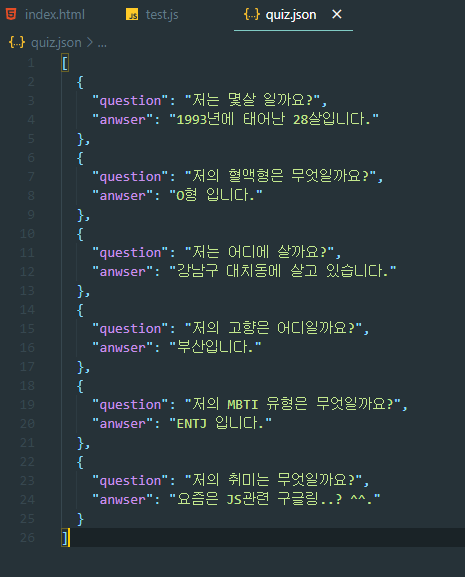
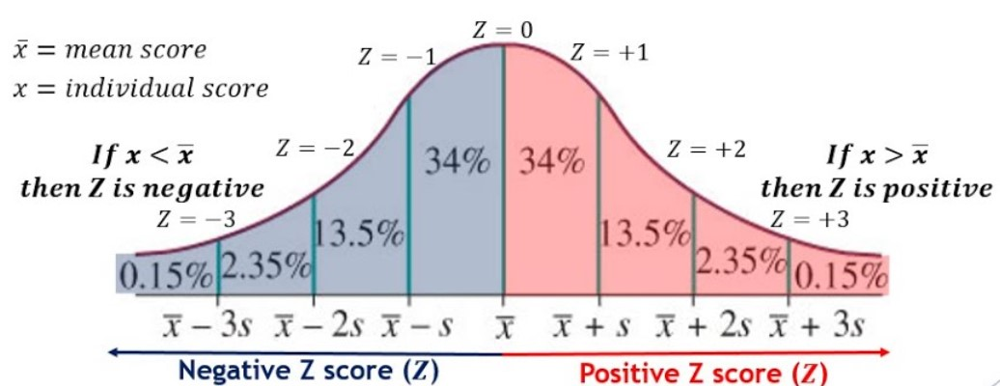

# 중요 : 개별 인원은 복수의 팀에 소속됩니다
# 패치 버전은 고려하지 않습니다

 
 
---
 
 

# 개괄

이하의 업무들을 활용하여 lol.ps나 op.gg에서 게정을 검색했을 때 나타나는 매치별 개인용 N인분 지표를 웹을 통해 표출

---
 
 

# 업무분장

## 1. Data Load

- Riot API 활용(League-V4, Match, Champion)

- 라이엇 API(developer) : https://developer.riotgames.com/

### 사용방법

- https://blog.uniony.me/lol/riot-api/

- https://cestmavie.tistory.com/64

요구 사항 : requests, JSON처리

 
 

## 2. Preprocessing

Json파일 전처리 => 판다스 DF

JSON 파일 예시

요구 사항 : 위와 같은 형태의 JSON 데이터를 pandas DF 형식으로 변환(컬럼-로우 숫자 형식 데이터로)

차후 분석 팀에서 필요한 컬럼이 누락되어 있을 경우 (ex:라인 위치가 명시되어 있지 않는 등), 세부 모델 혹은 방법론 등으로 해당 정보를 가능한 명시하여 토스

 
 

## 3. Analysis & Visualisation

모델 구성

최종 n인분 : 승률에 따른 정규분포 기준 Z점수로 판별(ex : 승률 ~84%라면 Z == +1)

 - Z분포 : 표준정규분포. Z는 해당 값이 위치할 누적확률을 나타냄.

 

---

ex
    게임이 끝나는 시점에서 어느 이즈리얼의 지표가 

    KDA = 10 / 4 / 7
    골드 = 21000
    피해량 = 17000
    타워피해량 = 3000
    받은피해 = 13000
    시야점수 = 3
    CC 점수 = 5

    일 때, 
    해당 성적과 유사한 플레이어들의 승률은 몇 퍼센트(0-+aZ)인지? 
    개별 지표들의 가중치를 구성해서 최종지표(N인분)을 계산 가능한지?
    ex : 0.3(kda) + 0.4(골드차이)

### 모델 예시 : KNN, Logitic, Probit
### 라인별 팀 분할 안건은 현재 상황에서는 보류중. 이후 데이터 여하, 역량 여하에 따라 결정.

- aZ를 통해서 n인분을 추론 가능한지?(제시된 그래프에서 s의 가중치를 얼마나 줄지, x\bar(평균) == 50(0.5))

- ex: 1 + n(aZ)라고 가정할 때, n의 값을 몇으로 할 것인지(n인분을 최종적으로 결정하는 파라미터)

## Not Defined
- 개별 지표(KDA, 골드, 피해랑, 타워피해량, 받은피해 etc)를 정규분포상의 지표로 삼을것인지? 

- 아니면 개별 지표를 최종지표(N인분)에 반영하는 별도의 세부 수식을 세울 것인지?

요구 사항 : 모델 구성, 시각화, 분석

+ 15분(라인전) 지표가 주어진다면 라인전 지표를 따로 산정하는 것도 고려(여건상 가능하다면)

 
 

## 4. Web Framing

개별 ID 정보를 받아서 API를 통해 데이터 추출

해당 데이터를 3의 모델(analysing, visualisation)에 투입하여 결과(n인분) 산출

산출된 데이터(N인분 지표)와 그래프(시각화)를 웹 화면에 표출

요구 사항 : 프론트엔드 구성, 웹페이지 구성, 백엔드 연동

참고 url: https://lol.ps/summoner/Hide%20on%20bush?region=kr

(주 : 이정도의 디자인이나 완성도를 요구하는 것이 아닙니다)

 
 
 
 
---

# 2. 목표 기한

멀티캠퍼스 최종프로젝트 도입 이전(12월 이전) 완성

기한이나 역량 여하에 따라, 세부적인 조정 등 업무의 변화가 있을 수 있음.